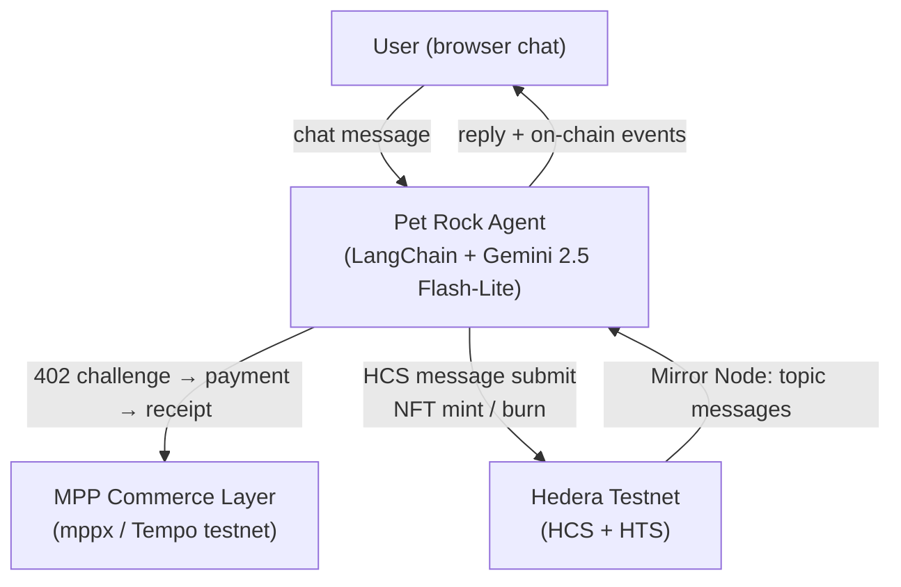

# Pet Rock

> **Live demo:** [paste-your-deployed-url-here]


Pet Rock is an on-chain Tamagotchi where you raise a pixel-art rock that lives on the Hedera network. Adopt it, feed it, play with it, groom it — or neglect it long enough and watch the NFT burn, publicly, on-chain, with a tombstone. No logins. No wallets. Just you, your rock, and the blockchain.

---

## How it works



**Two complementary layers:**

- **Hedera state layer** — each pet action (feed, play, groom, sleep, die) writes an HCS topic message. Pet stats are computed by replaying those messages with time-based decay. NFT minting (adopt) and burning (death) use HTS. Every action produces a real, inspectable transaction on HashScan.

- **MPP commerce layer** — pet-action API routes are gated behind HTTP 402 payment challenges via [`mppx`](https://github.com/BitteProtocol/mppx). The agent handles 402 challenges automatically using a Tempo testnet account. This is the pay-per-call transport layer; the Hedera transaction is what permanently records the action.

Pet Rock uses a treasury-signing model where the agent pays transaction fees on the user's behalf, with HBAR-equivalent charges flowing through the MPP layer. HashPack wallet-connect is wired in for explicit user signing of HBAR payments — the treasury handles NFT minting and all HCS submissions.

---

## Tech stack

| Layer | Technology |
|---|---|
| Frontend | Next.js 14+ (App Router), TypeScript, Tailwind CSS |
| Pixel world | PixiJS 8 — direct PIXI rendering, 60fps ticker animations |
| Hedera SDK | `@hashgraph/sdk` + `hedera-agent-kit` |
| LLM | Google Gemini 2.5 Flash-Lite via `@langchain/google-genai` |
| Commerce | Machine Payments Protocol via `mppx` |
| Network | Hedera testnet |
| State | HCS topics (one per pet), Mirror Node reads |
| NFTs | HTS non-fungible tokens |

---

## Setup

### Prerequisites

- Node.js 18+
- A Hedera testnet account (free at [portal.hedera.com](https://portal.hedera.com))
- A Google Gemini API key (free tier works — use `gemini-2.5-flash-lite`)

### 1. Clone and install

```bash
git clone https://github.com/0xredcap/petrock
cd petrock
npm install
```

### 2. Pixel art assets

Download the Kenney "Pixel Platformer" pack (CC0):

```bash
npm run setup:assets
```

This extracts tiles and character sprites into `public/assets/kenney/`.

### 3. Configure environment

Copy the example and fill in your values:

```bash
cp .env.example .env.local
```

**Hedera testnet operator** — from [portal.hedera.com](https://portal.hedera.com):
```
HEDERA_OPERATOR_ID=0.0.XXXXXXX
HEDERA_OPERATOR_KEY=302e...
HEDERA_NETWORK=testnet
```

**Google Gemini** — from [aistudio.google.com](https://aistudio.google.com):
```
GOOGLE_API_KEY=AIza...
```

**MPP accounts** — generate two burner testnet accounts (they autofund):
```bash
npx mppx account create   # → copy address as MPP_RECIPIENT_ADDRESS
npx mppx account create   # → copy private key as MPP_AGENT_PRIVATE_KEY
```

```
MPP_RECIPIENT_ADDRESS=0x...
MPP_CURRENCY=0x20c0000000000000000000000000000000000000
MPP_AGENT_PRIVATE_KEY=0x...
```

### 4. Create the NFT collection

```bash
npm run setup:collection
```

Copy the printed token ID into `.env.local`:
```
PET_ROCK_NFT_COLLECTION_ID=0.0.XXXXXXX
```

### 5. Run locally

```bash
npm run dev
```

Open [http://localhost:3000](http://localhost:3000). Type "adopt a pet rock" to get started.

---

## Deploy to Netlify

The repo includes a `netlify.toml` with the build config and `@netlify/plugin-nextjs` wired in — just connect the repo and it works.

1. Push this repo to GitHub (or it's already there)
2. In [app.netlify.com](https://app.netlify.com), click **Add new site → Import an existing project** and select the repo
3. Build settings are auto-detected from `netlify.toml` — no changes needed
4. Under **Site configuration → Environment variables**, add all variables from `.env.example`:
   - `HEDERA_OPERATOR_ID`, `HEDERA_OPERATOR_KEY`, `HEDERA_NETWORK`
   - `PET_ROCK_NFT_COLLECTION_ID`
   - `GOOGLE_API_KEY`
   - `MPP_RECIPIENT_ADDRESS`, `MPP_CURRENCY`, `MPP_AGENT_PRIVATE_KEY`
   - `NEXT_PUBLIC_APP_URL` — set this to your Netlify site URL (e.g. `https://pet-rock.netlify.app`)
5. Deploy

The Kenney assets under `public/assets/kenney/` are committed to git and deploy automatically.

---

## Pet lifecycle

| Action | Cost | Effect |
|---|---|---|
| Adopt | 1 HBAR | Mints NFT, creates HCS topic, sets hunger/mood/energy to 100 |
| Feed | 0.5 HBAR | hunger +30, mood +5 |
| Play | 0.5 HBAR | mood +30, energy -10 |
| Groom | 0.5 HBAR | mood +20, energy +10 |
| Sleep | Free | energy +40, mood -5, hunger -10 |
| Check status | Free | Reads + replays HCS messages with time decay |

Stats decay continuously:
- Hunger: -2/hour
- Mood: -1/hour  
- Energy: -1.5/hour

When hunger ≤ 0 AND mood ≤ 0, the rock dies. The next status check writes a `died` HCS message and burns the NFT.

---

## Verify on HashScan

Every action produces an inspectable transaction:

- [HashScan testnet](https://hashscan.io/testnet) — search by transaction ID, topic ID, or token ID
- The activity panel in the app links directly to each transaction

---

## Status

Pet Rock is in active development. Wallet-connect (HashPack) and on-chain policy controls for per-user signing are next.

---

*Pixel art tiles by Kenney (kenney.nl, CC0)*
