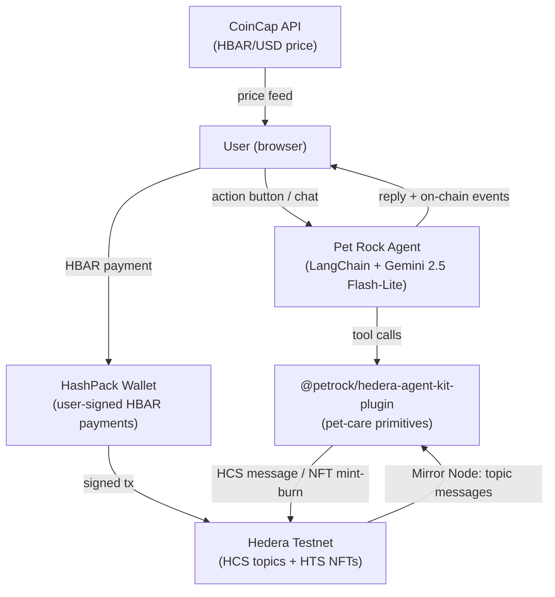

# Pet Rock

> **Live demo:** [paste-your-deployed-url-here]


Pet Rock is an on-chain Tamagotchi where you raise a pixel-art rock that lives on the Hedera network. Adopt it, feed it, play with it, groom it — or neglect it long enough and watch the NFT burn, publicly, on-chain, with a tombstone. No logins. No wallets. Just you, your rock, and the blockchain.

---

## How it works



**Architecture layers:**

- **Hedera state layer** — each pet action writes an HCS topic message signed by the treasury operator. Pet stats are computed by replaying those messages with time-based decay. NFT minting (adopt) and burning (death) use HTS. Every action produces an inspectable transaction on HashScan.

- **Plugin layer** — `@petrock/hedera-agent-kit-plugin` (in `packages/petrock-plugin/`) is a reusable Hedera Agent Kit plugin exposing seven pet-care tools: adopt, feed, play, groom, sleep, get state, and list pets. It owns the HCS/NFT lib and the stats replay logic including distress tracking.

- **Wallet layer** — HashPack wallet-connect handles explicit user signing for HBAR payments (1 HBAR to adopt, 0.5 HBAR per care action). The treasury signs all HCS submissions and NFT operations.

A pet enters **DISTRESS** when any stat drops to ≤ 15, triggering a 24-hour grace window recorded on-chain. If the user doesn't act in time, the pet dies: the NFT burns and a tombstone HCS message is written.

---

## Monorepo structure

```
/
├── packages/
│   ├── app/                  — Next.js app (frontend + API routes)
│   └── petrock-plugin/       — Hedera Agent Kit plugin (reusable)
└── README.md
```

---

## Tech stack

| Layer | Technology |
|---|---|
| Frontend | Next.js 16 (App Router), TypeScript, Tailwind CSS |
| Pixel world | PixiJS 8 — 60fps ticker, AI Town character sprites |
| Wallet | `@hashgraph/hedera-wallet-connect` (HashPack) |
| Hedera SDK | `@hashgraph/sdk` + `hedera-agent-kit` |
| Plugin | `@petrock/hedera-agent-kit-plugin` (workspace) |
| LLM | Google Gemini 2.5 Flash-Lite via `@langchain/google-genai` |
| Commerce | Machine Payments Protocol via `mppx` |
| Price feed | CoinCap via `coincap-hedera-plugin` |
| Network | Hedera testnet |
| State | HCS topics (one per pet + global registry), Mirror Node reads |
| NFTs | HTS non-fungible tokens |

---

## Setup

### Prerequisites

- Node.js 18+
- A Hedera testnet account (free at [portal.hedera.com](https://portal.hedera.com))
- A Google Gemini API key (free tier works)
- A WalletConnect project ID (free at [cloud.walletconnect.com](https://cloud.walletconnect.com))

### 1. Clone and install

```bash
git clone https://github.com/0xredcap/petrock--v2
cd petrock--v2
npm install        # installs all workspace packages
```

### 2. Pixel art assets

Download the Kenney "Pixel Platformer" pack (CC0) into `packages/app/`:

```bash
npm run setup:assets --workspace=@petrock/app
```

AI Town character sprites are already committed to `packages/app/public/assets/ai-town/`.

### 3. Configure environment

```bash
cp packages/app/.env.example packages/app/.env.local
```

Fill in your values — see `packages/app/.env.example` for a full list.

Key vars:
```
HEDERA_OPERATOR_ID=0.0.XXXXXXX
HEDERA_OPERATOR_KEY=302e...
HEDERA_NETWORK=testnet
PET_ROCK_NFT_COLLECTION_ID=         # created in step 4
PET_ROCK_REGISTRY_TOPIC_ID=         # created in step 4
GOOGLE_API_KEY=AIza...
NEXT_PUBLIC_WALLETCONNECT_PROJECT_ID=...
```

### 4. On-chain setup

```bash
# Create the NFT collection
npm run setup:collection --workspace=@petrock/app

# Create the global pet registry topic
npm run setup:registry
```

Copy both IDs into `.env.local`.

### 5. Run locally

```bash
npm run dev
```

Open [http://localhost:3000](http://localhost:3000). Connect HashPack (testnet), then click **Adopt**.

---

## Deploy to Netlify

The repo includes `netlify.toml` configured for the monorepo. Build command: `npm run build --workspace=@petrock/app`. Publish dir: `packages/app/.next`.

1. Push to GitHub
2. Connect at [app.netlify.com](https://app.netlify.com)
3. Add all env vars from `packages/app/.env.example`
4. Deploy

---

## Pet lifecycle

| Action | Cost | Effect |
|---|---|---|
| Adopt | 1 HBAR | Mints NFT, creates HCS topic, writes `born` message to registry |
| Feed | 0.5 HBAR | hunger +30, mood +5 |
| Play | 0.5 HBAR | mood +30, energy -10 |
| Groom | 0.5 HBAR | mood +20, energy +10 |
| Sleep | Free | energy +40, mood -5, hunger -10 |
| Check status | Free | Replays HCS with time decay, returns distress state |

Stats decay continuously:
- Hunger: −2/hour
- Mood: −1/hour
- Energy: −1.5/hour

A pet enters **DISTRESS** when any stat ≤ 15. A `distressed` HCS message is written with a `grace_until` timestamp 24 hours out. If a care action raises the stat above 30, a `recovered` message is written. If the grace window expires, the next status check writes `died` and burns the NFT.

---

## Verify on HashScan

Every action produces an inspectable transaction:

- [HashScan testnet](https://hashscan.io/testnet) — search by transaction ID, topic ID, or token ID
- The activity panel links directly to each transaction

---

## Status

Pet Rock is in active development. Social mechanics and a richer world are next.

---

## Credits

- **AI Town** (MIT, https://github.com/a16z-infra/ai-town) — character spritesheets (`32x32folk.png`) and tilemap assets
  - Tilesheet art: George Bailey (https://opengameart.org/content/16x16-game-assets)
  - Tilesheet art: hilau (https://opengameart.org/content/16x16-rpg-tileset)
  - Original assets: ansimuz (https://opengameart.org/content/tiny-rpg-forest)
  - UI pixel art: Mounir Tohami (https://mounirtohami.itch.io/pixel-art-gui-elements)
- **Kenney** (kenney.nl, CC0) — Pixel Platformer tile and character sprites
